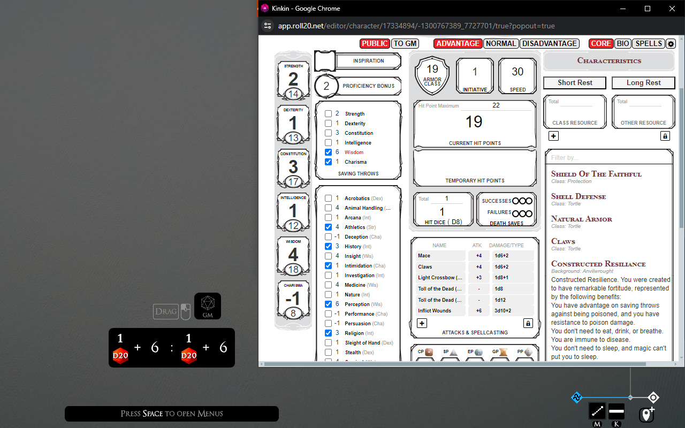
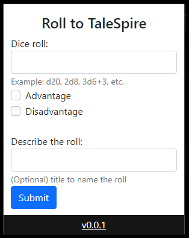

# Roll20 to TaleSpire
A TaleSpire companion application for sending rolls directly from your Roll20 character sheets into TaleSpire.

Motivation: My D&D group has recently made the switch from Roll20 to [TaleSpire](https://talespire.com/) as our VTT for our new campaign. TaleSpire does a great job with so many aspects of the tabletop gaming experience, but character sheets is not one of them. While there are a handful of plugins you can install to handle character sheets, none of them (in my opinion) are on par with a Roll20 character sheet. The biggest downside of using Roll20 to handle your character sheet for a TaleSpire game is being unable to roll from Roll20 directly into TaleSpire .. which is where this application comes in!

## Installation

- Fork, clone, or simply download the contents of this repo. You can download a zip using this [link](https://github.com/aptmac/roll20-to-talespire/archive/refs/heads/main.zip), and then extract the contents.
- Load the contents of this repo as an unpacked extension. 
  - Open Google Chrome and open `chrome://extensions` in a new tab
  - Enable developer mode by hitting the toggle in the upper right corner
  - Click the button labeled "Load unpacked", and select the `extension` directory of this repo
  - Optional: pin the extension to your toolbar by opening the extensions menu (the icon that looks like a puzzle piece), and selecting the pin next to this extension

## How to Use

### 1. Roll20 Character Sheet

From your character sheet you can make rolls from the `Core` section of the character sheet. There is also support to recognize the Advantage/Disadvantage toggle, which will load up your TaleSpire dice tray with two rolls.

- Open up your character sheet on Roll20
- With the character sheet window active, hover your mouse overtop the clickable label for the dice roll you want to perform. The text colour should turn from black to red.
- Hit `shift` on your keyboard
- A Chrome dialog should pop up asking if you want to open "TaleSpireUrlRelay". Yes you do, and you can toggle the option to "Always allow chrome-extension://[..]" and this dialog won't show up again.
- Over in TaleSpire, your dice tray should have been populated with the roll you selected in Roll20. Pickup the dice and roll!

#### Screenshot: Selected wisdom save at advantage

### 2. Chrome Extension Popup

From the popup you can quickly send whatever roll you want into TaleSpire, as long as it is of a valid dice type supported by the game. You can toggle Advantage/Disadvantage, and even add a name for your roll that will be displayed in the VTT.

- Click on the extension icon, and it will open a popup
- The popup allows you to type the target dice roll, toggle advantage/disadvantage, and provide a name for your roll which will be displayed in TaleSpire
- Enter your roll information, hit submit, and fire away!
- Note: the popup isn't that large, and it cuts off most of the Chrome dialog asking for permission when opening the TaleSpireUrlRelay. I highly suggest hitting the "Always allow chrome-extension://[..]" checkbox before hitting the "Open TaleSpireUrlRelay" button so the dialog doesn't show up again.

#### Screenshot:

